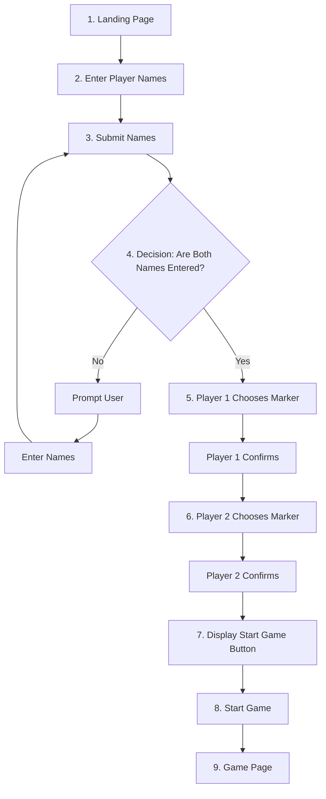

## Timeline

Duration: 1 Week

## User Stories

### (MVP Release)

<!-- - As a user, I want to see a <b>loading page</b> when I arrive at the website, so I know I'm in the right place. -->

- As a user, I want to see the <b>landing page</b> when I arrive at the website to know I'm in the right place.
- As a user, I want to be able to <b>key in my name</b>, so I know what is my character name.
- As a user, I want to see a pick <b>character</b> option so I know what character can I choose from.
- As a user, I want a <b>start game</b> button so I can start the game when I am ready.
- As a user, I want a <b>game page</b> after I clicked the start game button so I know the game has started.
- As a user, during the game I want to see <b>my character name/image shown</b> to indicate my presence.
- As a user, I want to know whose <b>turn</b> is it to roll the dice.
- As a user, I want a <b>roll dice button</b> so I can roll the dice.
- As a user, I want to see what number is rolled <b>(my dice digit)</b>.
- As a user, I want to see my <b>character/pointer moves</b> along the path.
- As a user, I want to know <b>who is the winner</b> of the game.

### (MMP Release)

- Includes all features in MVP Release.
- As a user, I could have a mystery item that provides boost to my character.
- As a user, I could have a mystery item that gives a disadvantage to my opponent.

## Game Architecture

### Landing Page:

1. Landing Page: The system displays the landing page.
2. Enter Player Names: User enters Player 1 and Player 2 names in the input fields and clicks the submit button.
3. Submit Names: The system checks if both names are entered.
4. Decision Point: Are both names entered?
   - Yes: Proceed to marker selection.
   - No: Prompt user to enter both names.
5. Player 1 Chooses Marker: Player 1 selects their marker color and confirms.
6. Player 2 Chooses Marker: Player 2 selects their marker color and confirms.
7. Display Start Game Button: The system displays the start game button.
8. Start Game: User clicks the start game button.
9. Game Page: The system navigates to the game page.

 
 

### Game Page:

1. XXXX

### Wireframe:

IMG

## Code Architecture

 

/_-------------- Constants -------------_/

/_---------- Variables (state) ---------_/

/_----- Cached Element References -----_/

/_---------- Render Functions ---------_/

/_-------------- Functions -------------_/

/_----------- Event Listeners ----------_/

 

Constants: This section defines fixed values that do not change throughout the game. These could include things like game settings, winning conditions, or other immutable values.

Variables (state): This section holds the game's dynamic state, such as the current board configuration, the current player, and whether the game is active or over.

Cached Element References: This section caches references to DOM elements that are frequently accessed or manipulated. This improves performance by avoiding repeated DOM queries.

Render Functions: This section defines all the functions that handle the rendering. Namely rendering functions.

Functions: This section defines all the functions that handle the game logic and state updates. These functions include the main game logic and helper functions.

Event Listeners: This section sets up event listeners that respond to user actions, such as clicks or key presses. These listeners trigger the appropriate functions to update the game state and re-render the UI.

 
 

Model: Handles game logic, rules, and data.
View: Renders the UI and updates based on Model data.
Controller: Manages user input and coordinates between Model and View.

## References

### Game References

### Code References

### Documentations

MVC Architecture: https://www.geeksforgeeks.org/mvc-design-pattern/  
Mermaid Markdown: https://docs.github.com/en/get-started/writing-on-github/working-with-advanced-formatting/creating-diagrams  
Flow Chart Documentation: https://info.aiim.org/aiim-blog/flowcharting-in-business-process-management
