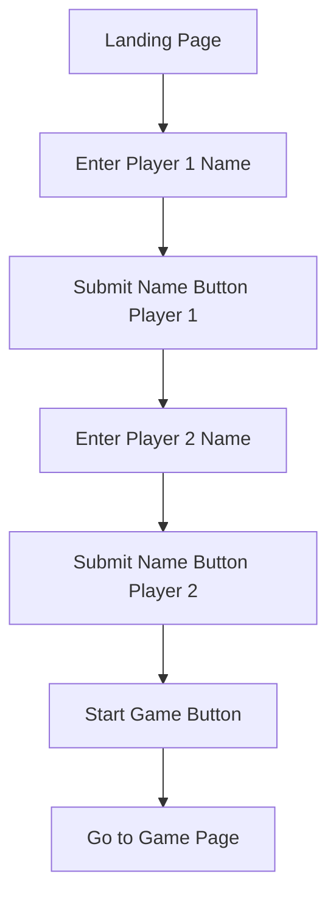
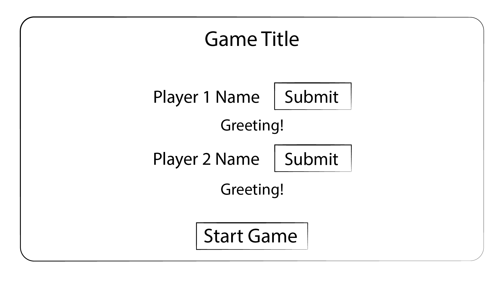
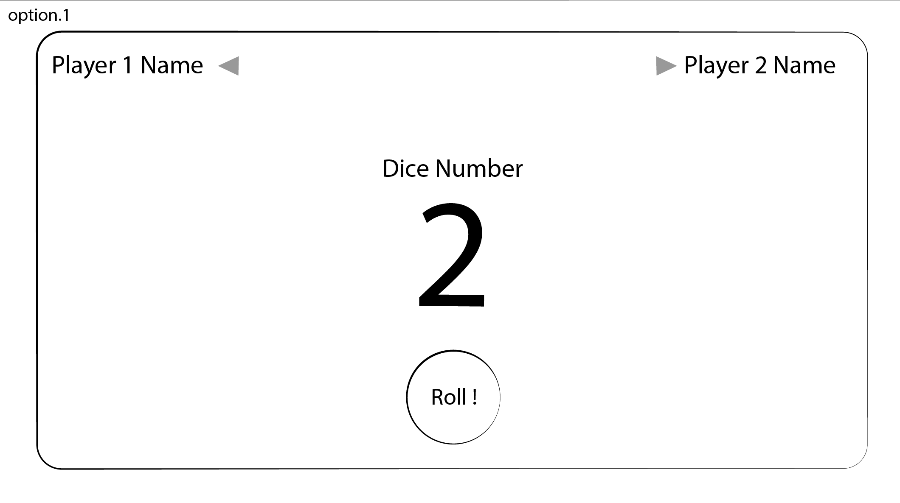
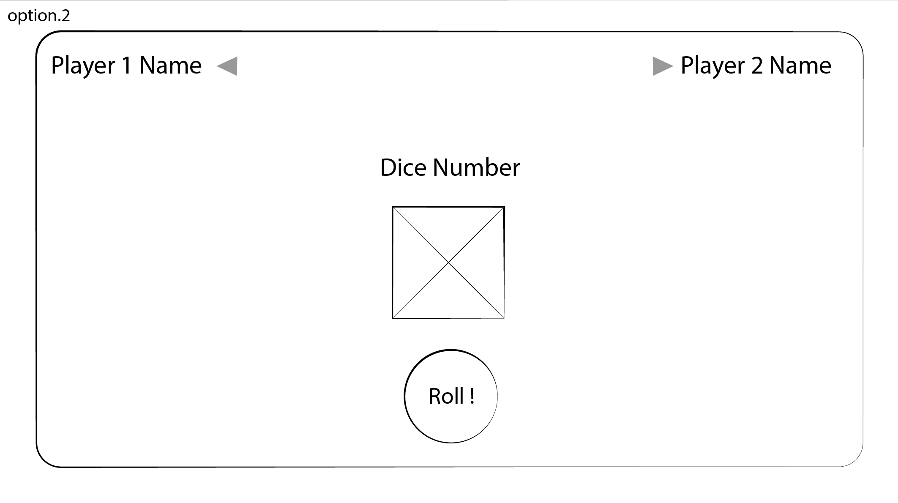
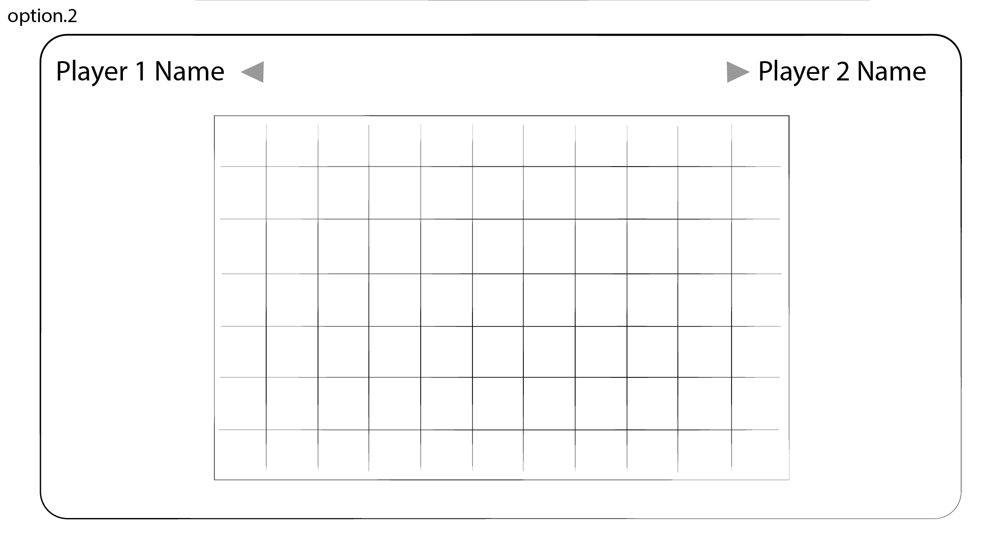

# Title of Game: Roll & Go!

## Objective of this Project

1. To develop a game that fulfil the MVP - Requirements set.
2. Includes project planning details
   - User stories
   - Wireframes
   - Game architecture
   - Code architecture
3. Meet the project deadline

## Timeline

- Duration: 1 Week

## Description of the Game

- This is a 2 player game that requires each player to roll the dice to determine how many moves they can make on the path. Who make it to the end of the path first wins the game.

## How to play the Game

- WIP

## User Stories

### (MVP - Requirement)

- As a user, I want to see the <b>landing page</b> when I arrive at the website to know I'm in the right place.
- As a user, I want to be able to <b>key in my name</b>, so I know what is my character name.
- As a user, I want a <b>start game</b> button so I can start the game when I am ready.
- As a user, I want a <b>game page</b> after I clicked the start game button so I know the game has started.
- As a user, during the game I want to see <b>my character name/image shown</b> to indicate my presence.
- As a user, I want a <b>roll dice button</b> so I can roll the dice.
- As a user, I want to see what number is rolled <b>(my dice digit)</b>.
- As a user, I want to see my <b>character/marker moves</b> along the path.
- As a user, I want to know <b>who is the winner</b> of the game.

### (Stretch Goals - Not Mandatory)

- Includes all features in MVP Release.
- As a user, I could have a mystery item that provides boost to my character.
- As a user, I could have a mystery item that gives a disadvantage to my opponent.

## Game Architecture

### Landing Page

1. Landing Page: The system displays the landing page.
2. Enter Player 1 Name: User enters Player 1 name in the input fields
3. Submit Name Button: Player 1 click submit name button
4. Enter Player 2 Name: User enters Player 2 name in the input fields
5. Submit Name Button: Player 2 click submit name button
6. Start Game Button: Start game button appears after the 2nd player clicked submit button
7. Go to Game Page



<br>

### Game Page

- WIP

## Wireframe

#### - Landing Page



#### - Game Page - Roll Stage - option 1



#### - Game Page - Roll Stage - option 2



#### - Game Page - Go Stage - option 1



## Code Architecture

<br>

/_-------------- Constants -------------_/

/_---------- Variables (state) ---------_/

```
const game = {
  players: [
    { name: "", currLocation: 0 },
    { name: "", currLocation: 0 },
  ],
  playerTurn: 0,
  rollNum: 0,
};
```

/_----- Cached Element References -----_/

```
board = {

}
```

/_---------- Render Functions ---------_/

```
render()

```

/_-------------- Functions -------------_/

```
handleClick()
handleNameSubmission()
checkWin()
resetGame()


```

/_----------- Event Listeners ----------_/

```
document.getElementById("startButton");
document.getElementById("rollButton");
document.getElementById("submitPlayer1")
document.getElementById("submitPlayer2")

```

<br>

## References

### Game References

### JavaScript References

### CSS References

- https://www.geeksforgeeks.org/how-to-add-a-pressed-effect-on-button-click-in-css/

### Documentations

- MVC Architecture: https://www.geeksforgeeks.org/mvc-design-pattern/ <br>
- Mermaid Markdown: https://docs.github.com/en/get-started/writing-on-github/working-with-advanced-formatting/creating-diagrams <br>
- Flow Chart Documentation: https://info.aiim.org/aiim-blog/flowcharting-in-business-process-management
