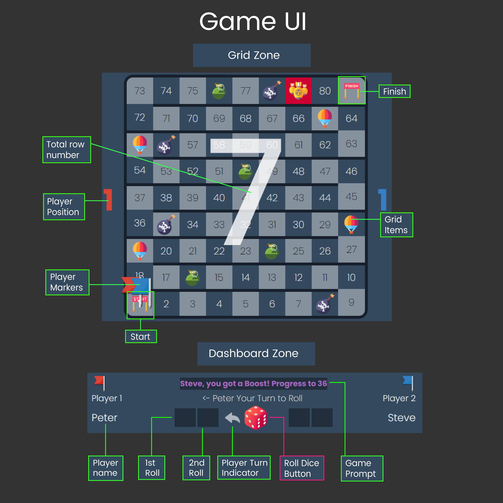
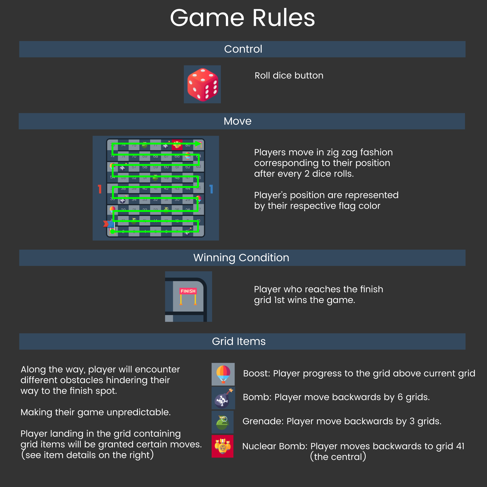
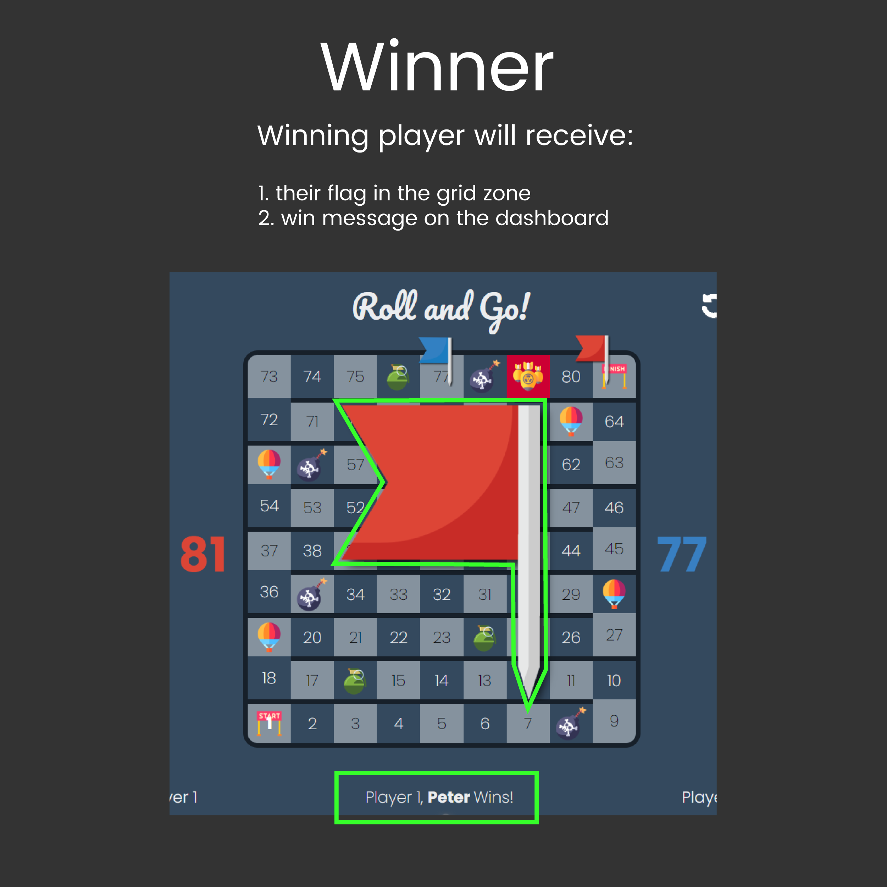
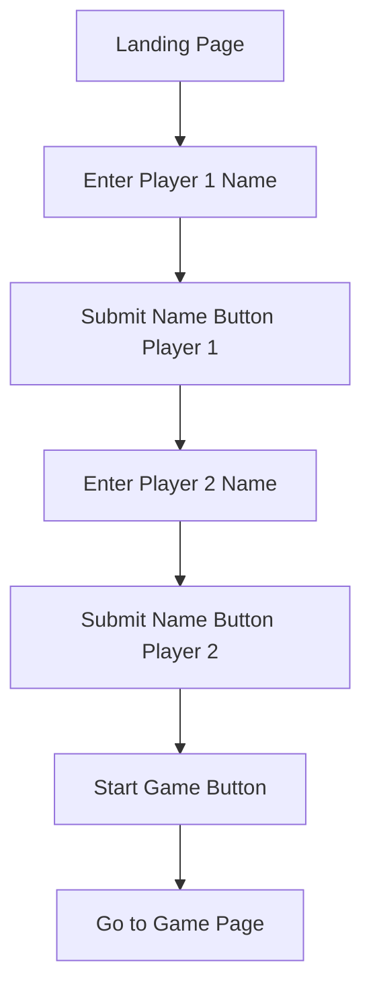
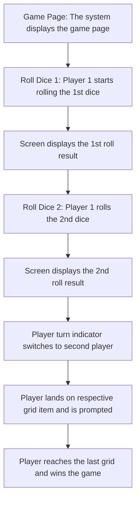

# Game Title: Roll & Go!


## Project Objective

1. To develop a game that fulfil the MVP - Requirements set.
2. Includes project planning details
   - User stories
   - Wireframes
   - Game architecture
   - Code architecture
3. Meet the project deadline

## Timeline

- Duration: 1 Week

## Game Description

- Roll and Go is a re-make of the commonly known game, Snakes & Ladders.

- This is a 2 player game that requires each player to roll the dice TWICE to determine how many moves they can make. Who make it to the last grid wins the game.

## How to play the Game





## Technology used

- Javascript, HTML, CSS

## User Stories

### (MVP - Requirement)

- As a user, I want to see the <b>landing page</b> when I arrive at the website to know I'm in the right place.
- As a user, I want to be able to <b>key in my name</b>, so I know what is my character name.
- As a user, I want a <b>start game</b> button so I can start the game when I am ready.
- As a user, I want a <b>game page</b> after I clicked the start game button so I know the game has started.
- As a user, during the game I want to see <b>my character name/image shown</b> to indicate my presence.
- As a user, I want a <b>roll dice button</b> so I can roll the dice.
- As a user, I want to see what number is rolled <b>(my dice digit)</b>.
- As a user, I want to see my <b>character/marker moves</b> along the path.
- As a user, I want to know <b>who is the winner</b> of the game.

### (Stretch Goals - Not Mandatory)

- Includes all features in MVP Release.
- As a user, I could have item that provides boost to my character.
- As a user, I could have item that gives a disadvantage to my opponent.

## Game Architecture

### Landing Page

1. Landing Page: The system displays the landing page.
2. Enter Player 1 Name: User enters Player 1 name in the input fields
3. Submit Name Button: Player 1 click submit name button
4. Enter Player 2 Name: User enters Player 2 name in the input fields
5. Submit Name Button: Player 2 click submit name button
6. Start Game Button: Start game button appears after the 2nd player clicked submit button
7. Go to Game Page



<br>

### Game Page

1. Game Page: The system display the game page
2. Roll Dice 1: Player 1 starts rolling the 1st dice
3. Screen display the 1st roll result
4. Roll Dice 2: Player 1 roll 2nd dice
5. Screen display the 2nd roll result
6. Player turn indicator switch to second player
7. Player landing onto respective grid item will be prompted
8. Player reaches the last grid wins the game



## Wireframe

#### - Landing Page


### - Game Page - Roll Stage - option 1


### - Game Page - Roll Stage - option 2


### - Game Page - Go Stage - option 1


## Code Architecture

<br>

/_-------------- Constants -------------_/

```
const game = {
players: [
{ Name: "", currLocation: 1, diceRollTotal: 0 },
{ Name: "", currLocation: 1, diceRollTotal: 0 },
],
gridItems: {
balloon: [19, 28, 55, 65],
bomb: [8, 35, 56, 78],
nuclearBomb: [79],
grenade: [16, 24, 50, 76],
},
playerTurn: 1,
rollNum: ["", ""],
};
let rollTotal = 0;
```

/_---------- Variables (state) ---------_/

/_----- Cached Element References -----_/

/_---------- Render Functions ---------_/

/_-------------- Functions -------------_/

/_----------- Event Listeners ----------_/

<br>

## References

### JavaScript

- https://medium.com/@belloquadriolawale/the-getboundingclientrect-method-5cd13e206bcf
- https://developer.mozilla.org/en-US/docs/Web/API/Element/getBoundingClientRect

### CSS

- https://www.w3schools.com/css/css_grid.asp
- https://www.geeksforgeeks.org/how-to-add-a-pressed-effect-on-button-click-in-css/
- https://developer.mozilla.org/en-US/docs/Web/CSS/CSS_grid_layout/Auto-placement_in_grid_layout

### Documentations

- MVC Architecture: https://www.geeksforgeeks.org/mvc-design-pattern/ <br>
- Mermaid Markdown: https://docs.github.com/en/get-started/writing-on-github/working-with-advanced-formatting/creating-diagrams <br>
- Flow Chart Documentation: https://info.aiim.org/aiim-blog/flowcharting-in-business-process-management

### Game Assets Attribution

<a href="https://www.flaticon.com/free-icons/finish" title="finish icons">Finish icons created by Good Ware - Flaticon</a><br>
<a href="https://www.flaticon.com/free-icons/start-button" title="start button icons">Start button icons created by Good Ware - Flaticon</a><br>
<a href="https://www.flaticon.com/free-icons/medal" title="medal icons">Medal icons created by Vectors Market - Flaticon</a><br>
<a href="https://www.flaticon.com/free-icons/reset" title="reset icons">Reset icons created by KP Arts - Flaticon</a><br>
<a href="https://www.flaticon.com/free-icons/grenade" title="grenade icons">Grenade icons created by Flat Icons - Flaticon</a><br>
<a href="https://www.flaticon.com/free-icons/bomb" title="bomb icons">Bomb icons created by max.icons - Flaticon</a><br>
<a href="https://www.flaticon.com/free-icons/bomb" title="bomb icons">Bomb icons created by Freepik - Flaticon</a><br>
<a href="https://www.flaticon.com/free-icons/forward" title="forward icons">Forward icons created by meaicon - Flaticon</a><br>
<a href="https://www.flaticon.com/free-icons/up-chevron" title="up chevron icons">Up chevron icons created by Pixel perfect - Flaticon</a>
<br>
<a href="https://www.flaticon.com/free-icons/bomb" title="bomb icons">Bomb icons created by vectorsmarket15 - Flaticon</a>
<br>
<a href="https://www.flaticon.com/free-icons/rocket" title="rocket icons">Rocket icons created by Freepik - Flaticon</a>
<br>
<a href="https://www.flaticon.com/free-icons/grenade" title="grenade icons">Grenade icons created by Umeicon - Flaticon</a>
<br>
<a href="https://www.flaticon.com/free-icons/hot-air-balloon" title="hot air balloon icons">Hot air balloon icons created by Freepik - Flaticon</a><br>
<a href="https://www.flaticon.com/free-icons/arrows" title="arrows icons">Arrows icons created by Maxim Basinski Premium - Flaticon</a><br>
<a href="https://www.flaticon.com/free-icons/play-button" title="play button icons">Play button icons created by Freepik - Flaticon</a><br>
<a href="https://www.flaticon.com/free-icons/dice" title="dice icons">Dice icons created by Nsit - Flaticon</a><br>
<a href="https://www.flaticon.com/free-icons/location-marker" title="location marker icons">Location marker icons created by Earthz Stocker - Flaticon</a><br>
<a href="https://www.flaticon.com/free-icons/dual-trigger-insurance" title="dual trigger insurance icons">Dual trigger insurance icons created by vectorsmarket15 - Flaticon</a><br>
<a href="https://www.flaticon.com/free-icons/hot-air-balloon" title="hot air balloon icons">Hot air balloon icons created by Smashicons - Flaticon</a><br>
<a href="https://pixabay.com/sound-effects/?utm_source=link-attribution&utm_medium=referral&utm_campaign=music&utm_content=39222">Sound by Pixabay</a><br>
<a href="https://www.flaticon.com/free-icons/question" title="question icons">Question icons created by Laura Reen - Flaticon</a>
<a href="https://www.flaticon.com/free-icons/question" title="question icons">Question icons created by iconset.co - Flaticon</a>
<a href="https://www.flaticon.com/free-icons/refresh" title="refresh icons">Refresh icons created by Freepik - Flaticon</a>

### Other References

https://github.com/jahid28/Games/blob/main/SnakesAndLadder/game.js
